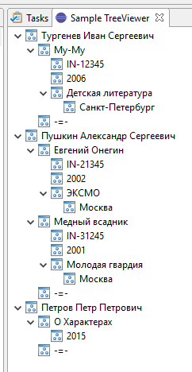

# Java_TreeViewerSample
Sample TreeView

This program was build to learn how to build TreeView with custom complex data.
The main idea was to display a tree using hierarhy of data. I have Author which has one or more Books or Article inside of it. 
The Book has some fields like name, ISBN, and Publisher. Publisher has its own data.

